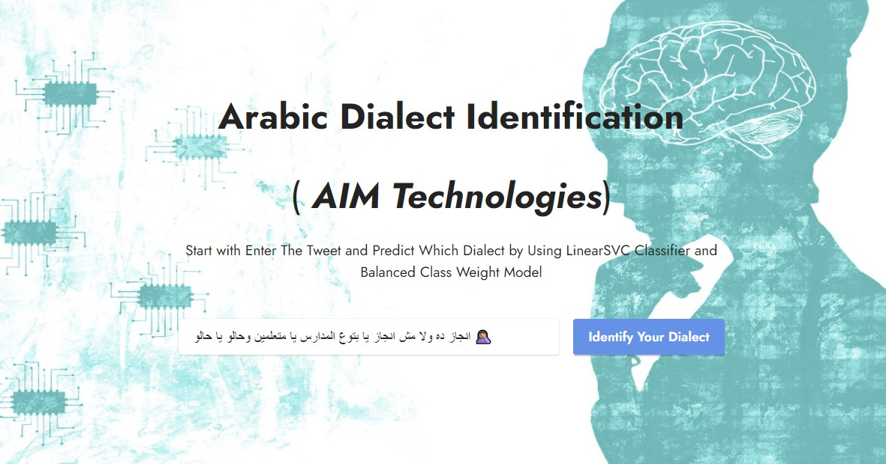
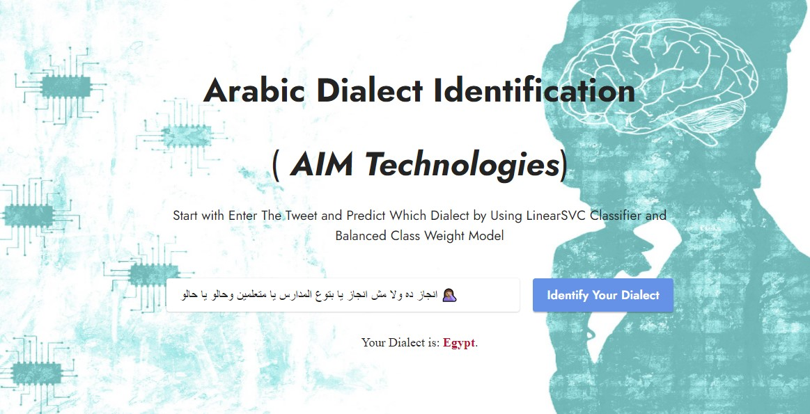

# Arabic_Dialect_Identification_NLP-AIM-Task
 ### Arabic has a widely varying collection of dialects. Many of these dialects remain under-studied due to the rarity of resources. 

The goal of AIM task is to classifying the dialect of the tweet writer given the tweet itself.

#### I used two approches:
##### 1- Machine Learning Aproach Using `LinearSVC`
##### 2- Deep Learning Approach Using `AraBERT Transformer`
-------------------------------------------------------------------------------------------
### The Deployment is by Machine learning model and steps to run the flask
##### 1- Download the pkl model from the drive in <a href="https://drive.google.com/file/d/10rMqbtYPBdrkh0bQxKeAerMCp6lzMyE-/view?usp=sharing">this link</a>
##### 2- Put the Model in the `Flask_Deployment` Folder
##### 3- From CMD `flask run`

<h1 style="color: blue"><b> Deployment </b></h1>

-------------------------------------------------------------------------------------------

